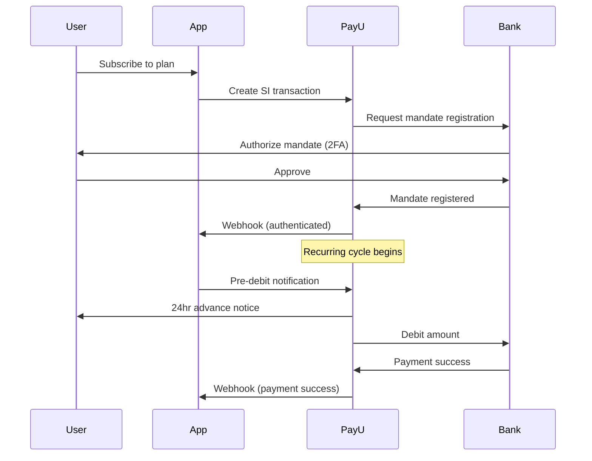
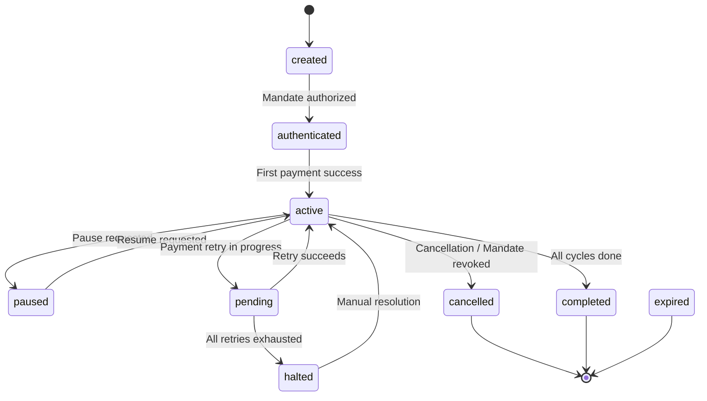

# better-auth-payu

A comprehensive [PayU](https://payu.in) plugin for [Better Auth](https://better-auth.com) — subscriptions via Standing Instructions (SI/e-Mandate), payments, refunds, webhooks, and organization billing out of the box.

---

## Features

- 🔄 **Subscription lifecycle** — create, cancel, pause, resume, update via PayU Standing Instructions
- 💳 **Payment processing** — initiate, verify, and check payments with hash-based security
- 🏦 **Mandate management** — check status, modify amount, support for card/UPI/netbanking mandates
- 💰 **Refund handling** — initiate and track refund status
- 🔔 **Webhook handling** — SHA-512 hash-verified webhook processing for all events
- 🏢 **Organization billing** — per-org subscriptions with seat management
- 🧪 **Test & production** — built-in support for PayU sandbox and live environments
- 🔒 **Type-safe** — full TypeScript support with typed error codes and status helpers

---

## Installation

```bash
npm install better-auth-payu
```

## Quick Start

### 1. Server Setup

```ts
import { betterAuth } from "better-auth";
import { payu } from "better-auth-payu";

export const auth = betterAuth({
  plugins: [
    payu({
      merchantKey: process.env.PAYU_MERCHANT_KEY!,
      merchantSalt: process.env.PAYU_MERCHANT_SALT!,
      apiBaseUrl: "https://test.payu.in", // Use production URL in prod

      subscription: {
        enabled: true,
        plans: [
          {
            planId: "pro-monthly",
            name: "pro",
            amount: "999",
            billingCycle: "MONTHLY",
            billingInterval: 1,
            totalCount: 12,
          },
          {
            planId: "enterprise-yearly",
            name: "enterprise",
            amount: "9999",
            billingCycle: "YEARLY",
            billingInterval: 1,
            totalCount: 5,
            trialDays: 14,
          },
        ],

        onSubscriptionActivated: async ({ subscription, plan, event }) => {
          console.log(`Subscription activated: ${subscription.id}`);
        },

        onPaymentSuccess: async ({ subscription, event }) => {
          console.log(`Payment received for: ${subscription.id}`);
        },
      },
    }),
  ],
});
```

### 2. Client Setup

```ts
import { createAuthClient } from "better-auth/client";
import { payuClient } from "better-auth-payu/client";

export const client = createAuthClient({
  plugins: [
    payuClient({
      subscription: true,
    }),
  ],
});
```

### 3. Webhook Endpoint

Register your webhook URL in the [PayU Dashboard](https://dashboard.payu.in):

```
https://your-domain.com/api/auth/payu/webhook
```

---

## Configuration

### `PayUOptions`

| Option          | Type                  | Required | Description                                |
| --------------- | --------------------- | -------- | ------------------------------------------ |
| `merchantKey`   | `string`              | ✅       | PayU Merchant Key                          |
| `merchantSalt`  | `string`              | ✅       | PayU Merchant Salt (V2 recommended)        |
| `apiBaseUrl`    | `string`              | ❌       | PayU API base URL (defaults to production) |
| `webhookSecret` | `string`              | ❌       | Additional webhook secret for verification |
| `subscription`  | `SubscriptionOptions` | ❌       | Subscription/SI configuration              |
| `organization`  | `OrganizationOptions` | ❌       | Organization billing configuration         |
| `schema`        | `object`              | ❌       | Custom schema overrides                    |

### `SubscriptionOptions`

Enable subscriptions by setting `subscription.enabled: true`:

```ts
subscription: {
  enabled: true,
  plans: [...],

  // Optional settings
  defaultPlan: "pro",
  startOnConsent: false,
  requireOrganization: false,

  // Payment & subscription callbacks
  onPaymentSuccess: async ({ subscription, plan, event }) => {},
  onPaymentFailure: async ({ event, error }) => {},
  onSubscriptionActivated: async ({ subscription, plan, event }) => {},
  onSubscriptionAuthenticated: async ({ subscription, plan, event }) => {},
  onSubscriptionCharged: async ({ subscription, plan, event }) => {},
  onSubscriptionCancelled: async ({ subscription, plan, event }) => {},
  onSubscriptionPaused: async ({ subscription, plan, event }) => {},
  onSubscriptionResumed: async ({ subscription, plan, event }) => {},
  onSubscriptionHalted: async ({ subscription, plan, event }) => {},
  onSubscriptionPending: async ({ subscription, plan, event }) => {},
  onSubscriptionCompleted: async ({ subscription, plan, event }) => {},

  // Mandate callbacks
  onMandateRevoked: async ({ subscription, plan, event }) => {},
  onMandateModified: async ({ subscription, plan, event }) => {},
  onRefundComplete: async ({ event, refund }) => {},
}
```

### Plan Configuration

```ts
interface PayUPlan {
  planId: string; // Unique plan identifier
  name: string; // Plan name used internally
  amount: string; // Amount per billing cycle (e.g., "999")
  billingCycle: PayUBillingCycle; // DAILY, WEEKLY, MONTHLY, etc.
  billingInterval: number; // How many cycles between charges (1 = every cycle)
  totalCount: number; // Total number of charges (0 = unlimited)
  annualPlanId?: string; // Optional annual variant ID
  trialDays?: number; // Free trial duration in days
  metadata?: Record<string, unknown>; // Additional plan metadata
}
```

### Billing Cycle Options

| Cycle         | Description    |
| ------------- | -------------- |
| `DAILY`       | Every day      |
| `WEEKLY`      | Every week     |
| `FORTNIGHTLY` | Every 2 weeks  |
| `MONTHLY`     | Every month    |
| `BIMONTHLY`   | Every 2 months |
| `QUARTERLY`   | Every 3 months |
| `BI_YEARLY`   | Every 6 months |
| `YEARLY`      | Every year     |
| `ADHOC`       | On-demand      |
| `ASPRESENTED` | As presented   |

---

## API Endpoints

### Subscription Endpoints

| Method | Path                                   | Description                            |
| ------ | -------------------------------------- | -------------------------------------- |
| `POST` | `/payu/subscription/create`            | Create a new subscription              |
| `POST` | `/payu/subscription/pay-and-subscribe` | Initiate payment & create subscription |
| `POST` | `/payu/subscription/cancel`            | Cancel an active subscription          |
| `POST` | `/payu/subscription/pause`             | Pause an active subscription           |
| `POST` | `/payu/subscription/resume`            | Resume a paused subscription           |
| `GET`  | `/payu/subscription/list`              | List subscriptions for user/reference  |
| `GET`  | `/payu/subscription/get`               | Get a specific subscription            |
| `POST` | `/payu/subscription/update`            | Update a subscription                  |
| `POST` | `/payu/subscription/pre-debit-notify`  | Send pre-debit notification            |
| `POST` | `/payu/subscription/charge`            | Charge a subscription                  |
| `POST` | `/payu/subscription/update-si`         | Update standing instruction            |

### Mandate Endpoints

| Method | Path                   | Description           |
| ------ | ---------------------- | --------------------- |
| `GET`  | `/payu/mandate/status` | Check mandate status  |
| `POST` | `/payu/mandate/modify` | Modify mandate amount |

### Payment Endpoints

| Method | Path                     | Description                  |
| ------ | ------------------------ | ---------------------------- |
| `POST` | `/payu/payment/initiate` | Initiate a payment with hash |
| `POST` | `/payu/payment/verify`   | Verify a completed payment   |
| `POST` | `/payu/payment/check`    | Check payment status         |

### Refund Endpoints

| Method | Path                    | Description                |
| ------ | ----------------------- | -------------------------- |
| `POST` | `/payu/refund/initiate` | Initiate a refund          |
| `GET`  | `/payu/refund/status`   | Check refund status        |
| `POST` | `/payu/refund/list`     | List refunds for reference |

### Transaction Endpoints

| Method | Path                        | Description                   |
| ------ | --------------------------- | ----------------------------- |
| `GET`  | `/payu/transaction/info`    | Get transaction info by txnid |
| `GET`  | `/payu/transaction/details` | Get detailed transaction data |

### Utility Endpoints

| Method | Path                     | Description               |
| ------ | ------------------------ | ------------------------- |
| `POST` | `/payu/upi/validate-vpa` | Validate a UPI VPA        |
| `GET`  | `/payu/plan/list`        | List all configured plans |
| `GET`  | `/payu/plan/get`         | Fetch a specific plan     |

### Webhook

| Method | Path            | Description           |
| ------ | --------------- | --------------------- |
| `POST` | `/payu/webhook` | PayU webhook receiver |

---

## Usage Examples

### Create Subscription

```ts
// Client-side
const { data } = await client.payu.subscription.create({
  plan: "pro",
  mandateType: "upi", // "card" | "upi" | "netbanking"
});
```

### Pay and Subscribe (Combined)

```ts
const { data } = await client.payu.subscription.payAndSubscribe({
  plan: "pro",
  mandateType: "card",
  initialAmount: "999",
});
```

### Cancel Subscription

```ts
// Cancel immediately
await client.payu.subscription.cancel({});

// Cancel at end of billing cycle
await client.payu.subscription.cancel({
  cancelAtCycleEnd: true,
});
```

### Pause / Resume

```ts
await client.payu.subscription.pause({});
await client.payu.subscription.resume({});
```

### List Subscriptions

```ts
const { data } = await client.payu.subscription.list({});
```

### Initiate Payment

```ts
const { data } = await client.payu.payment.initiate({
  txnid: "TXN_" + Date.now(),
  amount: "500",
  productinfo: "Premium Plan",
  firstname: "John",
  email: "john@example.com",
  phone: "9876543210",
});
```

### Check Mandate Status

```ts
const { data } = await client.payu.mandate.status({
  subscriptionId: "sub_123",
});
```

### Organization Subscription

```ts
const { data } = await client.payu.subscription.create({
  plan: "enterprise",
  referenceId: "org_123",
  customerType: "organization",
  mandateType: "card",
});
```

---

## Standing Instructions (SI) / e-Mandate

PayU uses Standing Instructions (SI) for recurring payments, which work through mandates (payment authorizations):



### Mandate Types

| Type         | Description                                  |
| ------------ | -------------------------------------------- |
| `card`       | Card-based recurring payments (debit/credit) |
| `upi`        | UPI autopay mandate                          |
| `netbanking` | Netbanking e-mandate (eNACH/eSign)           |

---

## Organization Integration

Enable organization-level billing by adding the `organization` option. Requires the Better Auth [Organization plugin](https://www.better-auth.com/docs/plugins/organization).

```ts
payu({
  merchantKey: "...",
  merchantSalt: "...",

  organization: {
    enabled: true,
    seatManagement: true,
    authorizeReference: async ({ action, organizationId, userId, role }) => {
      // Check if user has permission to manage org subscriptions
      return role === "owner" || role === "admin";
    },
  },

  subscription: {
    enabled: true,
    plans: [...],
  },
});
```

### Authorization Actions

When `authorizeReference` is configured, it's called for these actions:

| Action                 | When                          |
| ---------------------- | ----------------------------- |
| `create-subscription`  | Creating a new subscription   |
| `cancel-subscription`  | Cancelling a subscription     |
| `pause-subscription`   | Pausing a subscription        |
| `resume-subscription`  | Resuming a subscription       |
| `update-subscription`  | Updating subscription details |
| `list-subscriptions`   | Listing subscriptions         |
| `get-subscription`     | Fetching a subscription       |
| `check-mandate-status` | Checking mandate status       |
| `modify-mandate`       | Modifying mandate amount      |
| `initiate-payment`     | Initiating a payment          |
| `verify-payment`       | Verifying a payment           |
| `initiate-refund`      | Creating a refund             |
| `check-refund-status`  | Checking refund status        |
| `list-refunds`         | Listing refunds               |

---

## Database Schema

The plugin automatically extends your database with the following tables/fields:

### `user` table (extended)

| Field            | Type      | Description              |
| ---------------- | --------- | ------------------------ |
| `payuCustomerId` | `string?` | PayU customer identifier |

### `subscription` table (new)

| Field                | Type       | Description                                |
| -------------------- | ---------- | ------------------------------------------ |
| `id`                 | `string`   | Primary key                                |
| `plan`               | `string`   | Plan name                                  |
| `referenceId`        | `string`   | User ID or organization ID                 |
| `payuCustomerId`     | `string?`  | PayU customer ID                           |
| `payuSubscriptionId` | `string?`  | PayU subscription ID                       |
| `payuMandateType`    | `string?`  | Mandate type (`card`, `upi`, `netbanking`) |
| `payuTransactionId`  | `string?`  | PayU transaction ID                        |
| `payuMihpayid`       | `string?`  | PayU payment ID                            |
| `status`             | `string`   | Subscription status (default: `"created"`) |
| `currentStart`       | `date?`    | Current billing cycle start                |
| `currentEnd`         | `date?`    | Current billing cycle end                  |
| `endedAt`            | `date?`    | When subscription ended                    |
| `quantity`           | `number?`  | Billing quantity (default: `1`)            |
| `totalCount`         | `number?`  | Total billing cycles                       |
| `paidCount`          | `number?`  | Completed billing cycles (default: `0`)    |
| `remainingCount`     | `number?`  | Remaining billing cycles                   |
| `cancelledAt`        | `date?`    | Cancellation timestamp                     |
| `pausedAt`           | `date?`    | Pause timestamp                            |
| `cancelAtCycleEnd`   | `boolean?` | Scheduled cancellation flag                |
| `billingPeriod`      | `string?`  | Billing period                             |
| `seats`              | `number?`  | Number of seats                            |
| `trialStart`         | `date?`    | Trial start date                           |
| `trialEnd`           | `date?`    | Trial end date                             |
| `metadata`           | `string?`  | JSON metadata                              |

### `organization` table (extended, when enabled)

| Field            | Type      | Description              |
| ---------------- | --------- | ------------------------ |
| `payuCustomerId` | `string?` | PayU customer identifier |

---

## Subscription Status Lifecycle



| Status          | Description                                      |
| --------------- | ------------------------------------------------ |
| `created`       | Subscription created, awaiting SI authentication |
| `authenticated` | Mandate registered, awaiting first charge        |
| `active`        | Active and charging on schedule                  |
| `pending`       | Payment retry in progress                        |
| `halted`        | All payment retries exhausted                    |
| `paused`        | Temporarily paused                               |
| `cancelled`     | Cancelled or mandate revoked                     |
| `completed`     | All billing cycles completed                     |
| `expired`       | Subscription expired                             |

---

## Webhook Events

The plugin handles these webhook events, routed by the `status` and `notificationType` fields:

| Event Condition                                           | Handler                                        | Description            |
| --------------------------------------------------------- | ---------------------------------------------- | ---------------------- |
| `status = "success"`                                      | `onPaymentSuccess` + `onSubscriptionActivated` | Payment successful     |
| `status = "failure"`                                      | `onPaymentFailure`                             | Payment failed         |
| `status = "pending"`                                      | `onSubscriptionPending`                        | Payment pending        |
| `status = "halted"`                                       | `onSubscriptionHalted`                         | Retries exhausted      |
| `status = "cancelled"`                                    | `onSubscriptionCancelled`                      | Subscription cancelled |
| `status = "completed"`                                    | `onSubscriptionCompleted`                      | All cycles complete    |
| `status = "paused"`                                       | `onSubscriptionPaused`                         | Subscription paused    |
| `status = "resumed"` / `"active"`                         | `onSubscriptionResumed`                        | Subscription resumed   |
| `notificationType = "mandate_revoked"` / `"si_cancelled"` | `onMandateRevoked`                             | Mandate revoked        |
| `notificationType = "mandate_modified"` / `"si_modified"` | `onMandateModified`                            | Mandate modified       |

Each handler automatically:

1. Verifies the webhook hash (SHA-512)
2. Finds the corresponding local subscription by `txnid` or UDF fields
3. Updates the subscription status in your database
4. Calls your optional lifecycle callback

---

## PayU Hash Security

PayU uses SHA-512 hash verification for payment security. The plugin handles hash generation and verification automatically:

```
hash = SHA-512(key|txnid|amount|productinfo|firstname|email|udf1|...|udf10||salt)
```

For webhook verification (reverse hash):

```
hash = SHA-512(salt|status||||||udf10|udf9|...|udf1|email|firstname|productinfo|amount|txnid|key)
```

---

## UDF Field Mapping

PayU uses User Defined Fields (udf1–udf10) for metadata. The plugin reserves the first 5 fields for internal tracking:

| UDF Field    | Internal Usage                               |
| ------------ | -------------------------------------------- |
| `udf1`       | Customer type (`"user"` or `"organization"`) |
| `udf2`       | User ID                                      |
| `udf3`       | Organization ID (if applicable)              |
| `udf4`       | Subscription ID                              |
| `udf5`       | Reference ID                                 |
| `udf6–udf10` | Available for custom metadata                |

### UDF Helpers

```ts
import {
  customerUdf,
  subscriptionUdf,
  udfToParams,
  paramsToUdf,
} from "better-auth-payu";

// Set customer UDF
const udf = customerUdf.set({ customerType: "user", userId: "user_123" });

// Set subscription UDF
const udf = subscriptionUdf.set({
  userId: "user_123",
  subscriptionId: "sub_456",
  referenceId: "user_123",
});

// Convert UDF object to PayU API params
const params = udfToParams(udf);
// → { udf1: "user", udf2: "user_123", ... }

// Extract UDF from PayU response
const udf = paramsToUdf(webhookBody);
const { userId, subscriptionId } = subscriptionUdf.get(udf);
```

---

## Utility Functions

Import these helpers for subscription status checks:

```ts
import {
  isActive,
  isAuthenticated,
  isPaused,
  isCancelled,
  isTerminal,
  isUsable,
  hasPaymentIssue,
  toSubscriptionStatus,
  timestampToDate,
  dateStringToDate,
  generatePayUHash,
  generateCommandHash,
  verifyPayUHash,
} from "better-auth-payu";
```

### Status Helpers

| Function               | Description                                            |
| ---------------------- | ------------------------------------------------------ |
| `isActive(sub)`        | Status is `"active"`                                   |
| `isAuthenticated(sub)` | Status is `"authenticated"`                            |
| `isPaused(sub)`        | Status is `"paused"`                                   |
| `isCancelled(sub)`     | Status is `"cancelled"`                                |
| `isTerminal(sub)`      | Status is `"cancelled"`, `"completed"`, or `"expired"` |
| `isUsable(sub)`        | Status is `"active"` or `"authenticated"`              |
| `hasPaymentIssue(sub)` | Status is `"pending"` or `"halted"`                    |

### Hash Helpers

| Function                                        | Description                                  |
| ----------------------------------------------- | -------------------------------------------- |
| `generatePayUHash(params, salt)`                | Generate SHA-512 hash for payment initiation |
| `generateCommandHash(key, command, var1, salt)` | Generate hash for PayU API commands          |
| `verifyPayUHash(params, salt, hash)`            | Verify a reverse hash from PayU webhook      |

### Date Helpers

| Function                    | Description                                      |
| --------------------------- | ------------------------------------------------ |
| `timestampToDate(ts)`       | Convert Unix timestamp (seconds) to `Date`       |
| `dateStringToDate(str)`     | Convert PayU date string to `Date`               |
| `toSubscriptionStatus(str)` | Convert string to typed `PayUSubscriptionStatus` |

---

## Error Codes

All error codes are exported for client-side matching:

```ts
import { PAYU_ERROR_CODES } from "better-auth-payu/client";
```

<details>
<summary>All error codes</summary>

| Category         | Code                                  | Message                         |
| ---------------- | ------------------------------------- | ------------------------------- |
| **Auth**         | `UNAUTHORIZED`                        | Unauthorized access             |
|                  | `INVALID_REQUEST_BODY`                | Invalid request body            |
| **Subscription** | `SUBSCRIPTION_NOT_FOUND`              | Subscription not found          |
|                  | `SUBSCRIPTION_PLAN_NOT_FOUND`         | Subscription plan not found     |
|                  | `ALREADY_SUBSCRIBED_PLAN`             | Already subscribed to this plan |
|                  | `REFERENCE_ID_NOT_ALLOWED`            | Reference id is not allowed     |
|                  | `SUBSCRIPTION_NOT_ACTIVE`             | Subscription is not active      |
|                  | `SUBSCRIPTION_ALREADY_CANCELLED`      | Already cancelled               |
|                  | `SUBSCRIPTION_ALREADY_PAUSED`         | Already paused                  |
|                  | `SUBSCRIPTION_NOT_PAUSED`             | Not paused, cannot resume       |
|                  | `SUBSCRIPTION_IN_TERMINAL_STATE`      | In terminal state               |
| **Customer**     | `CUSTOMER_NOT_FOUND`                  | PayU customer not found         |
|                  | `UNABLE_TO_CREATE_CUSTOMER`           | Unable to create customer       |
| **Webhook**      | `WEBHOOK_HASH_NOT_FOUND`              | Webhook hash not found          |
|                  | `WEBHOOK_SECRET_NOT_FOUND`            | Webhook secret not found        |
|                  | `WEBHOOK_ERROR`                       | Webhook error                   |
|                  | `FAILED_TO_VERIFY_WEBHOOK`            | Failed to verify hash           |
| **Hash**         | `HASH_GENERATION_FAILED`              | Failed to generate hash         |
|                  | `HASH_VERIFICATION_FAILED`            | Hash verification failed        |
| **Mandate**      | `MANDATE_NOT_FOUND`                   | Mandate not found               |
|                  | `MANDATE_REVOKE_FAILED`               | Failed to revoke mandate        |
|                  | `MANDATE_MODIFY_FAILED`               | Failed to modify mandate        |
|                  | `MANDATE_STATUS_CHECK_FAILED`         | Failed to check status          |
| **Payment**      | `PAYMENT_INITIATION_FAILED`           | Failed to initiate payment      |
|                  | `PAYMENT_VERIFICATION_FAILED`         | Failed to verify payment        |
|                  | `PAYMENT_NOT_FOUND`                   | Payment not found               |
| **Refund**       | `REFUND_INITIATION_FAILED`            | Failed to initiate refund       |
|                  | `REFUND_STATUS_CHECK_FAILED`          | Failed to check status          |
| **Transaction**  | `TRANSACTION_NOT_FOUND`               | Transaction not found           |
|                  | `TRANSACTION_DETAILS_FAILED`          | Failed to get details           |
| **Pre-Debit**    | `PRE_DEBIT_NOTIFICATION_FAILED`       | Failed to send notification     |
| **Organization** | `ORGANIZATION_ON_ACTIVE_SUBSCRIPTION` | Org has active subscription     |
|                  | `ORGANIZATION_NOT_FOUND`              | Organization not found          |
| **SI**           | `SI_UPDATE_FAILED`                    | Failed to update SI             |
|                  | `INVALID_SI_PARAMS`                   | Invalid SI parameters           |
| **VPA**          | `VPA_VALIDATION_FAILED`               | Failed to validate VPA          |
|                  | `INVALID_VPA`                         | Invalid VPA address             |

</details>

---

## Environment Variables

```env
PAYU_MERCHANT_KEY=your_merchant_key
PAYU_MERCHANT_SALT=your_merchant_salt_v2
PAYU_WEBHOOK_SECRET=your_webhook_secret    # Optional
PAYU_API_BASE_URL=https://test.payu.in     # Use https://info.payu.in for production
```

### PayU API URLs

| Environment    | Base URL               | Payment URL                       |
| -------------- | ---------------------- | --------------------------------- |
| **Test**       | `https://test.payu.in` | `https://test.payu.in/_payment`   |
| **Production** | `https://info.payu.in` | `https://secure.payu.in/_payment` |

---

## Types

All types are exported for your use:

```ts
import type {
  PayUTransactionResponse,
  PayUWebhookEvent,
  Subscription,
  SubscriptionCallbackData,
  SubscriptionOptions,
} from "better-auth-payu";
```

---

## License

MIT
